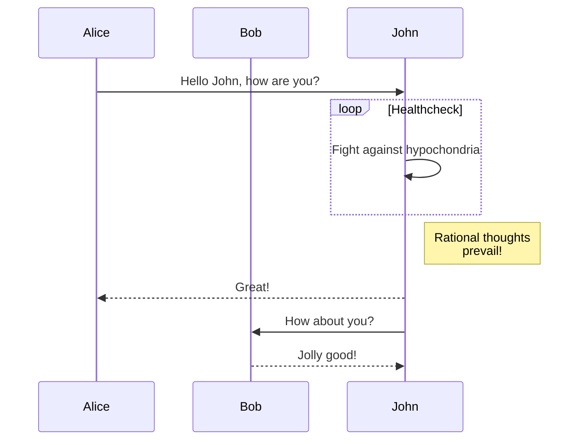
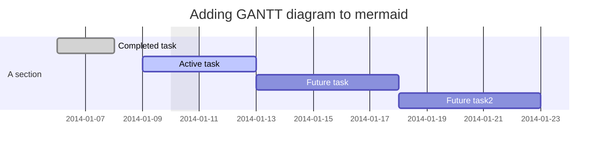
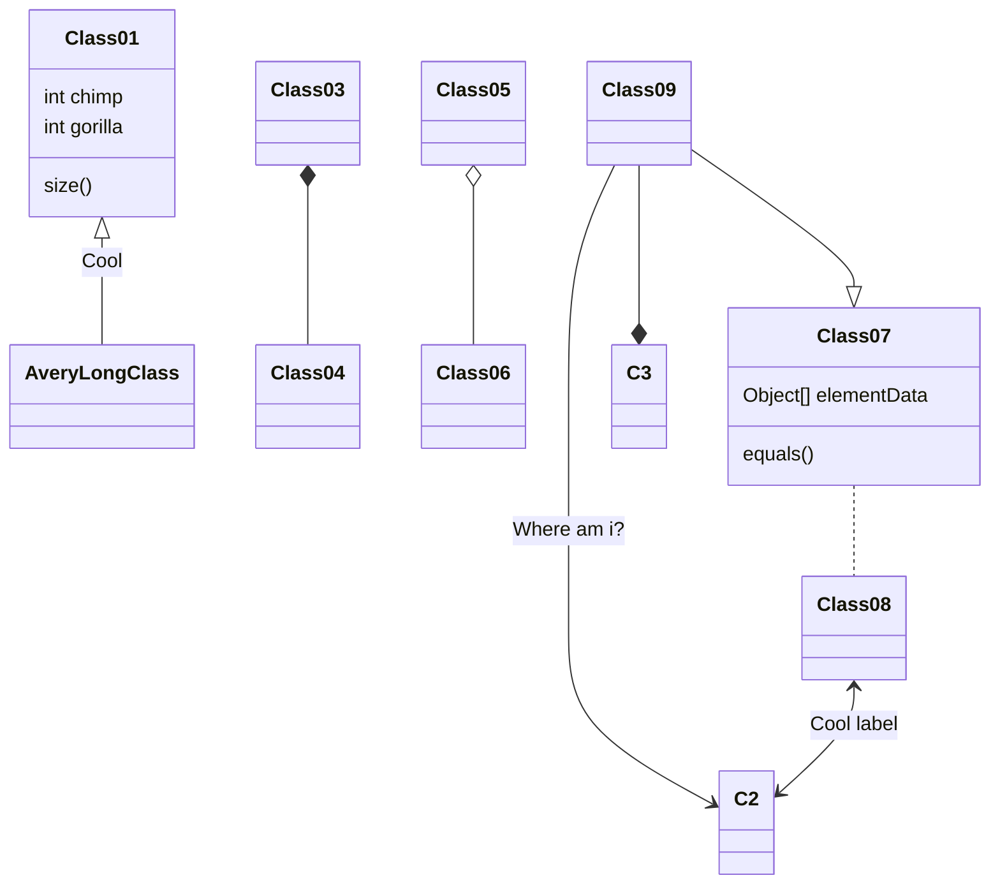


---

## 流程图


```

```

## 顺序图


```
    ```mermaid
    sequenceDiagram
        participant Alice
        participant Bob
        Alice->>John: Hello John, how are you?
        loop Healthcheck
            John->>John: Fight against hypochondria
        end
        Note right of John: Rational thoughts <br/>prevail!
        John-->>Alice: Great!
        John->>Bob: How about you?
        Bob-->>John: Jolly good!
    ```
```

```sequence
Title: タイトル
A -> B: メッセージ
Note right of B: メッセージ
A --> B: メッセージ
B ->> A: メッセージ
```
```
    ```sequence
    Title: タイトル
    A -> B: メッセージ
    Note right of B: メッセージ
    A --> B: メッセージ
    B ->> A: メッセージ
    ```
```
## 甘特图



```
    ```mermaid
    gantt
    dateFormat  YYYY-MM-DD
    title Adding GANTT diagram to mermaid
    excludes weekdays 2014-01-10

    section A section
    Completed task            :done,    des1, 2014-01-06,2014-01-08
    Active task               :active,  des2, 2014-01-09, 3d
    Future task               :         des3, after des2, 5d
    Future task2               :         des4, after des3, 5d
    ```  
```


## 类图



```
  ```mermaid
  classDiagram
  Class01 <|-- AveryLongClass : Cool
  Class03 *-- Class04
  Class05 o-- Class06
  Class07 .. Class08
  Class09 --> C2 : Where am i?
  Class09 --* C3
  Class09 --|> Class07
  Class07 : equals()
  Class07 : Object[] elementData
  Class01 : size()
  Class01 : int chimp
  Class01 : int gorilla
  Class08 <--> C2: Cool label
  ```
```
